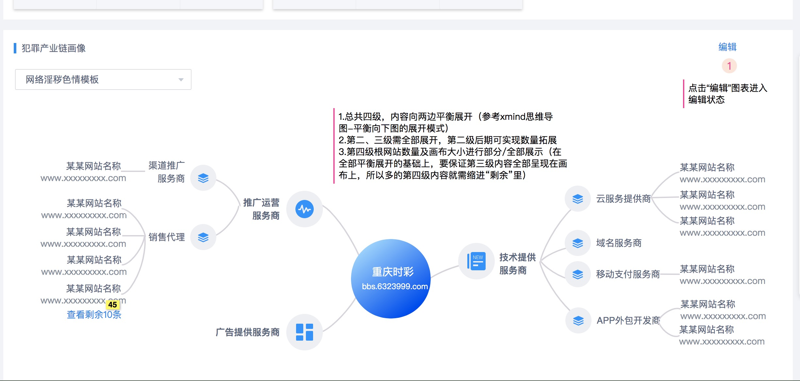
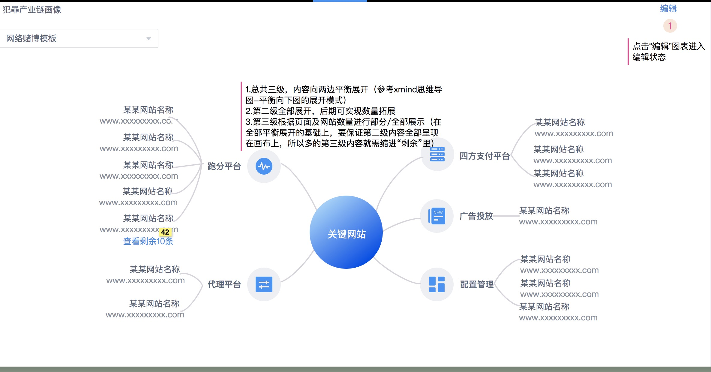
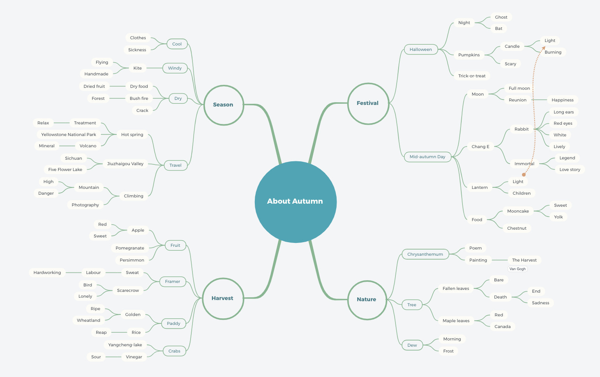
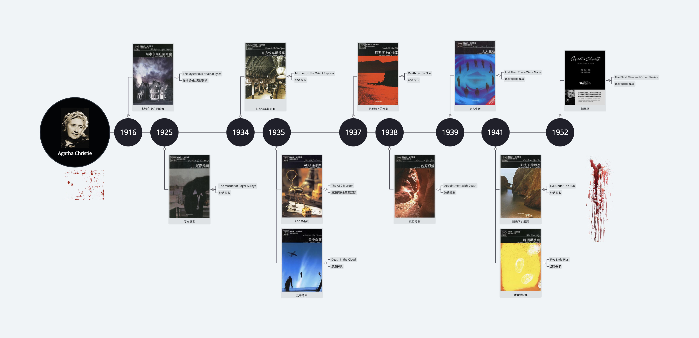
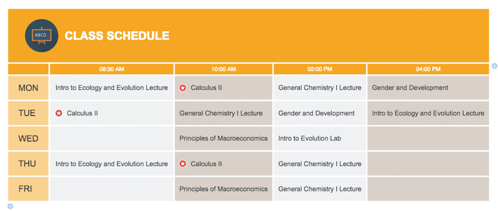

<!-- treeXmind文档 -->
# treeXmind文档 

https://zhuanlan.zhihu.com/p/105467597
Balanced Binary Tree

### 1. 绘制模版：
> 1. 模版一：第三级全部展示，第四级动态折叠

> 2. 模块二：第三级根据 数据、面板 动态折叠

### 2. 要求：
> 1. 根据分支的数据动态排列分布 [动态规划]
> 2. 两边保持数据平衡
> 3. 根据数据要求改变 图标的状态

### 3.思路：
> + 【处理数据】获取数据的每一层的子级总数，求平均数，然后划分区域（左右两侧）
> + 【绘制方法】从最外层开始绘制，组件式拼接模块
> + 【vue插槽】svg中可以使用slot插槽，可以考虑下
> + 【分支线形】目前仅支持直线，后期可以提供：直线，曲线、箭头线、圆角折线、圆角斜切线、彩虹渐变分支、线条渐细

### 4.XMind 提供多种思维结构可供选择：
> + 平衡图（思维导图）：思维导图最基础的结构，可用来发散和纵深思考
> + 逻辑图（向左/向右）：表达基础的总分关系或分总关系等
> + 组织结构图（向上/向下）：可以做组织层次的人员构成或金字塔结构
> + 时间轴（水平/竖直）：表示时间顺序或者事情的先后逻辑
> + 鱼骨图（向左/向右）：用来进行事件分析、因果分析、问题分析等
> + 矩阵图（行/列）：可以用来做项目的任务管理或个人计划，对比分析
> + 自由结构：利用自由主题和联系进行自由组合，随意组织思维

> 平衡图

> 时间轴

> 矩阵图

### 5. 主题
> + 中心主题：中心主题是导图的核心，也是画布的中心，每一张思维导图有且仅有一个中心主题。
> + 分支主题：中心主题发散出来的第一级主题为分支主题。
> + 子主题：分支主题发散出来的下一级主题为子主题。
> + 自由主题：独立于中心主题结构外的主题，可单独存在，作为结构外的补充

### 6. 逻辑元素
> + 联系：任意两个主题之间用于显示特殊关系的自定义连接线。如果两个主题或外框主题之间有关联性，可以用「联系」将二者关联起来，并添加文字描述定义这个关系。
> + 概要：在思维导图中，概要用于为选中主题添加总结文字。当你想对几个主题进行总结和概括，进一步对主题进行总结和升华时，可以添加概要。
> + 外框：围绕主题的封闭区域。当你想强调和凸显某些主题内容，或告诉读者某些特殊概念时，可以用外框将这些主题框在一起，并进行注释

> 逻辑元素 
